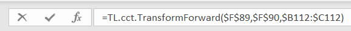
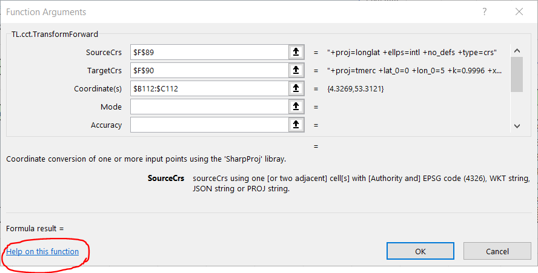

# TopoLib V1.0

### Excel extension library (*.xll) for Coordinate Conversion and Transformation functions

#### 1	Packages used

**TopoLib** contains a number of User Defined Functions (UDFs) for *Coordinate Conversion and Transformation*, supported by Ribbon Commands, made available as an Excel extension. The code is based on a number of open source libraries, that are available for download on [GitHub](https://github.com/).

The code is made available under the [ZLib license](License.md).   The  main open source libraries underpinning TopoLib are :

| Library                                                      | Version   | License type |
| ------------------------------------------------------------ | --------- | :----------: |
| [ExcelDna](https://github.com/Excel-DNA/ExcelDna).Add-In     | 1.5.0     |     ZLIB     |
| [ExcelDna](https://github.com/Excel-DNA/ExcelDna).Integration | 1.5.0     |     ZLIB     |
| [ExcelDna](https://github.com/Excel-DNA/ExcelDna).IntelliSense | 1.5.0     |     ZLIB     |
| [ExcelDnaDoc](https://github.com/Excel-DNA/ExcelDnaDoc)      | 1.5.0     |     ZLIB     |
| [SharpProj](https://github.com/AmpScm/SharpProj)             | 8.1001.60 |  Apache 2.0  |
| [SharpProj](https://github.com/AmpScm/SharpProj).Core        | 8.1001.60 |  Apache 2.0  |
| [XlDialogBox](https://github.com/Duijndam-Dev/XlDialogBox)   | 1.0.0     |     MIT      |

These packages need to be installed from NuGet.  Note that ExcelDnaDoc requires a version not higher than 1.5.0 at present. SharpProj is the core to package to TopoLib, as it makes the C/C++ [proj library](https://proj.org/index.html) accessible from C#

#### 2	PROJ - Coordinate Conversion and Transformation 

**PROJ** is a generic coordinate transformation software that transforms geospatial coordinates from one coordinate reference system (CRS) to another. This includes cartographic projections as well as geodetic transformations.

PROJ started purely as a cartography application letting users convert geodetic coordinates into projected coordinates using a number of different cartographic projections. Over the years, as the need has become apparent, support for datum shifts has slowly worked its way into PROJ as well. Today PROJ supports more than a hundred different map projections and can transform coordinates between datums using all but the most obscure geodetic techniques.

PROJ is widely used in the industry, for instance [QGIS](https://www.qgis.org/en/site/), depends on it. QGIS is a very well established Open Source Geographic Information System. 

#### 3	Excel-DNA

This is the second approach of creating the TopoLib library. The original version was built using C++ in conjunction with the [XLW-library](https://github.com/xlw/xlw) to create Excel extensions. The XLW-library is no longer actively maintained, and therefore the transition to 64-bit Excel became troublesome. This is where `Excel-DNA`  came to the rescue (*note: 'DNA' stands for DotNet for Applications, similar to VBA - Visual Basic for Applications*). This made a transition to C# mandatory.  Therefore, PROJ (*written in C++*) either needed to be replaced by a similar library written in C# (like the [DotSpatial](https://github.com/DotSpatial/DotSpatial) library),  or alternatively C#  bindings to PROJ needed to be used. 

#### 4	SharpProj

The the [DotSpatial](https://github.com/DotSpatial/DotSpatial) library is not very actively maintained. The PROJ library in contrary has made major changes to its functionality and API and an improved accuracy over the past few years. So it would be great to link against that library (somehow). 

Interfacing managed C# code with native C++ is however very tricky, and various methods are possible (*P/Invoke, COM Interop or C++/CLI*), each with their own pros and cons. See for instance this [MSDN article](https://social.msdn.microsoft.com/Forums/vstudio/en-US/299da822-5539-4e5b-9ba7-b614e564c9f4/presenting-a-c-library-lib-for-use-in-c-project?forum=vcgeneral), or this [blog article](https://mark-borg.github.io/blog/2017/interop/).  

The advantage of using C++/CLI is that the resulting 'mixed language' DLL can **absorb the static PROJ library**, thereby reducing the number of DLL's required in your project by one. When used as a (thin) C## wrapper around PROJ, additional type checking and functionality can be also implemented.

This is where [SharpProj](https://github.com/AmpScm/SharpProj) comes into the picture. It exposes the PROJ library through managed C++/CLI classes, which in turn can be consumed by Excel.DNA to create UDF's in Excel. Almost each basic PROJ C-routine finds its counterpart in SharpProj.

#### 5	Current status

At present, TopoLib is still Work-in-Progress. Not all classes/functions from SharpProj have yet been implemented, and the Ribbon Interface to set persistent library variables has not been completed.

But overall, the Add-In is already very functional; after all, as an end-user you want to convert coordinates from `(lat, long)` to `(x, y)` and the like. For this to happen, you need effectively **just one call**: 

`=TL.cct.TransformForward($F$89,$F$90,$B112:$C112)` 

This will transform the coordinates you provided in `$B112:$C112`to new coordinates using the source Coordinate Reference System (CRS) defined in `$F$89` and the target CRS defined in `$F$90`. That is all there is to it !

#### 6	Future work

The following is planned:

- Finish installation batch file
- Complete CCT (Coordinate Conversion and Transformation) functionality
- Complete CRS (Coordinate Reference System) functionality
- Add Ribbon interface for persistent library settings

#### 7	Finally

The project comes with an example spreadsheet to show how you can use the code. If you get 'lost' please us `fx` on the formula editor.

 

You should then see a dialog like the following

 

There is an explanation of the purpose of each variable, in this case **SourceCrs** is highlighted. Clicking `Help on this function` will bring up the precompiled help file with extra information on how to use this function.

When all required packages have been installed from GitHub, it is time to build the project. As part of the Post-build events, the batch file `build.bat` is called that creates a `publish` folder at the root of the project. Step into this folder and step down to select the proper version of Excel you are using (x64 or x86). Then double-click the *.xll file, to load the Add-In. Once the Add-In is loaded, the UDF's are recognized by Excel and you can run the example spreadsheet(s). 

An installation script will be created to store the *.xll and associated files in the right folder on your PC. Right now, please double click the *.xll file to get it loaded.  Have fun using the tool and make improvement suggestions if you'd have these...
